# 🛒 E-Commerce Flutter App

A modern and user-friendly **E-Commerce mobile application** built with Flutter.  
The application provides a complete shopping experience, from authentication and product browsing to cart management and order placement.

---

## 📸 Screenshots


<p align="center">
  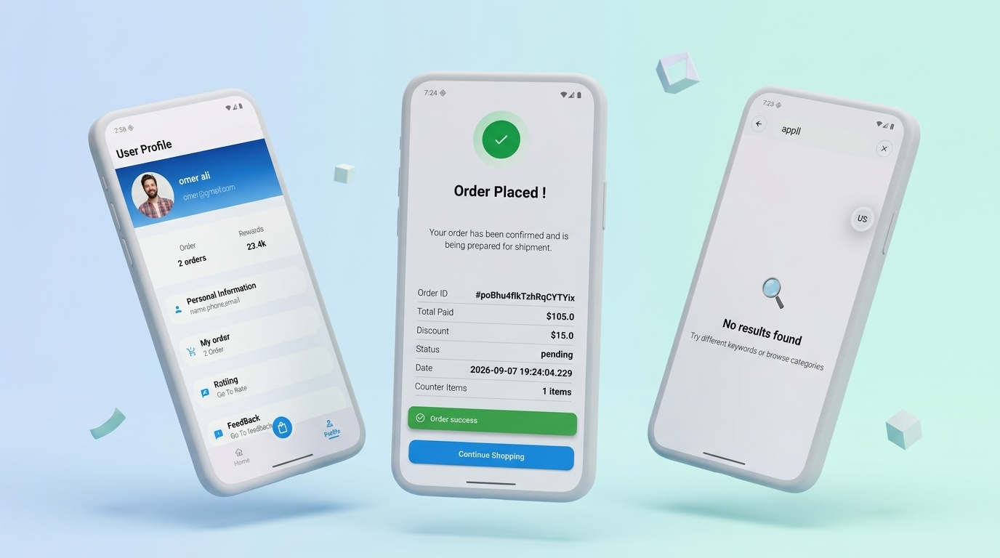
 
   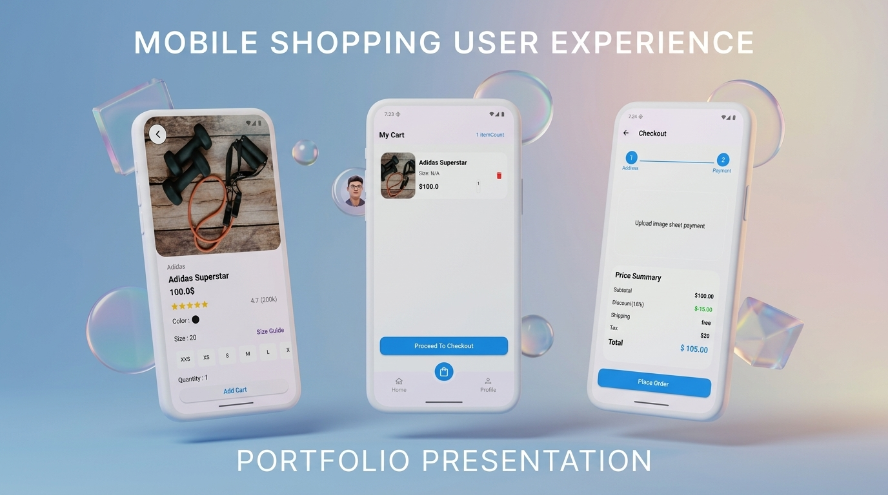
</p>

<p align="center">
  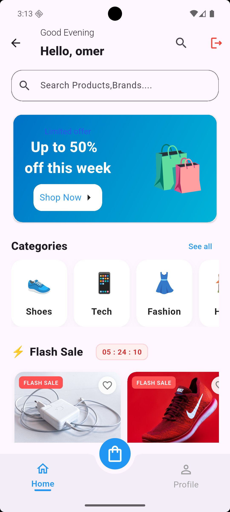
 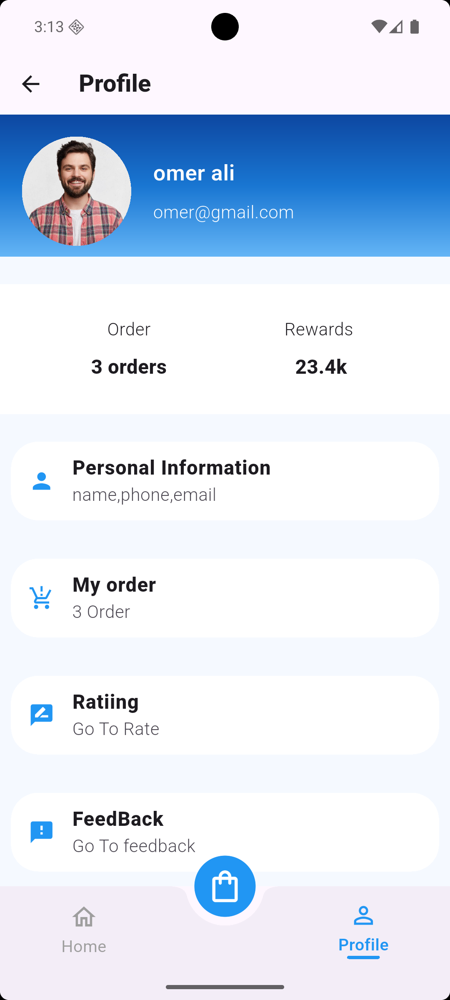
  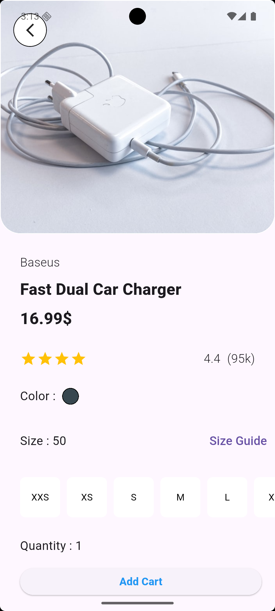
  
  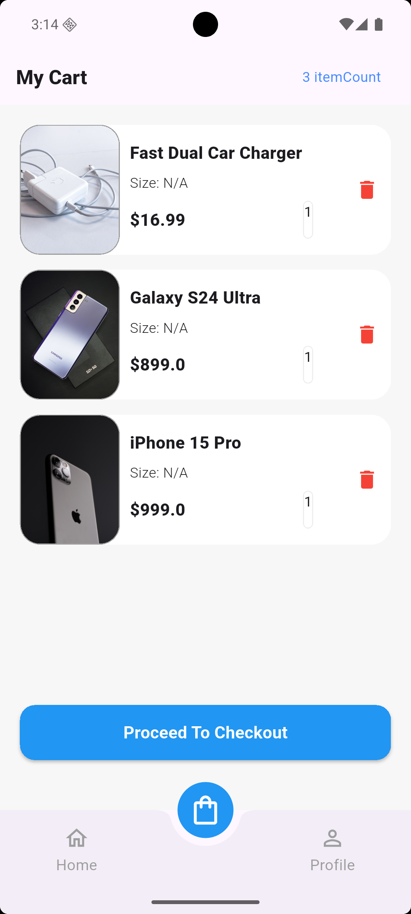
 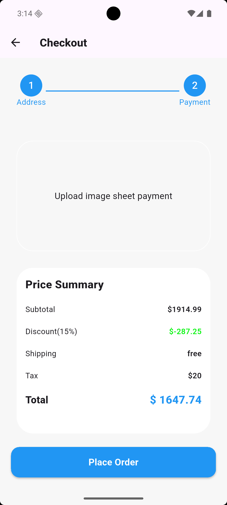
  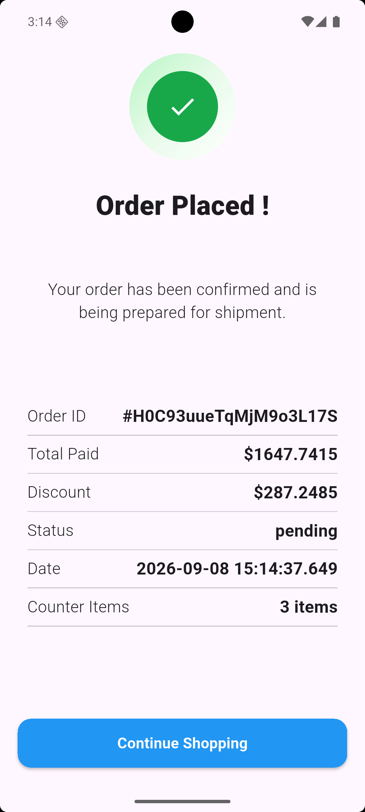
  
  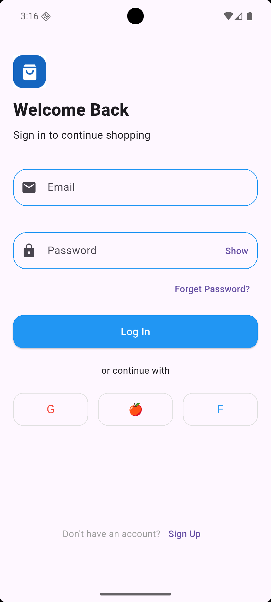
 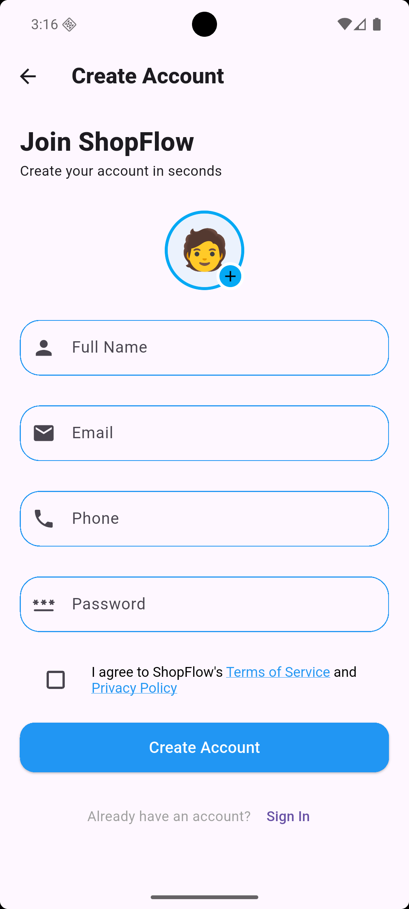
  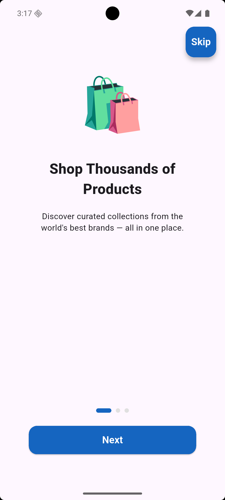
  
</p>


<p align="center">

</p>


<p align="center">
  
</p>

---

## ✨ Features

### 🔐 Authentication
- Login
- Register
- Forget Password
- User authentication
- Secure user session

### 🏠 Home
- Browse products
- Featured products
- Product categories
- Modern and responsive UI

### 🔎 Search
- Search for products
- Search results
- Empty search state

### 🛍️ Products
- View all products
- Product information
- Product images
- Product price
- Product details

### 📦 Product Details
- Detailed product information
- Product images
- Price
- Description
- Add product to cart

### 🛒 Cart
- Add products to cart
- Remove products
- Update product quantity
- Calculate total price
- Checkout

### 📋 Orders
- Place orders
- Order confirmation
- Order ID
- Total paid
- Discount
- Order status
- Order date
- Number of items

### 👤 Profile
- User profile
- Personal information
- My Orders
- Rating
- Feedback

---

## 🛠️ Technologies

- **Flutter**
- **Dart**
- **Firebase**
- **Firebase Authentication**
- **Cloud Firestore**
- **Firebase Storage**
- **Flutter Bloc / Cubit**
- **Feature First Architecture**

---

## 🏗️ Project Architecture

The project follows a **Feature-First** structure to keep the code organized and scalable.

```text
lib/
│
├── core/
│   ├── api/
│   ├── error/
│   ├── network/
│   ├── routing/
│   └── utils/
│
├── feature/
│   │
│   ├── auth/
│   │   ├── login/
│   │   ├── register/
│   │   └── forget_password/
│   │
│   ├── home/
│   │
│   ├── product/
│   │   ├── product/
│   │   └── product_details/
│   │
│   ├── search/
│   │
│   ├── cart/
│   │
│   ├── order/
│   │
│   └── profile/
│
└── main.dart
